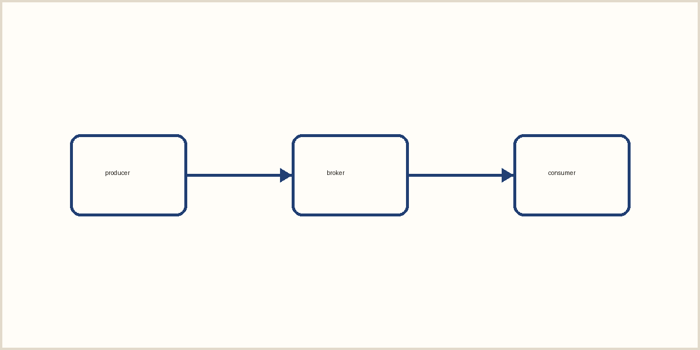

This page is a test bed. It is long enough to wrap across many lines at every viewport, and it mixes
the things technical writing is made of: version numbers such as pnpm 12.6.0 and Node 26, timings such as
a build that took ~1.8 s, list references such as Item 11, and acronyms such as API, CI, HTML and CSS. The
readability harness measures line length, hyphenation, heading hierarchy and rhythm on this text, so it
has to read like a real article rather than a list of samples.

## Headings and identifiers

Identifiers must read exactly as typed, wherever the line breaks: `@astrojs/markdown-remark`,
`markdown.remarkPlugins`, `configure-pages@v6`, `astro-expressive-code` and `mdxExpressions` all appear in
running text here, next to ordinary words that are long enough to be hyphenated, such as internationalisation,
interoperability and characteristically.

### A subsection set in italics

Subsections sit under a section and above its paragraphs. They should rank below the section heading by
size and form, and above the body text.

#### A fourth-level heading

Fourth-level headings are rare, but when they appear they must not fall back to the browser's bold.

## Running `astro check` in a heading

Code inside a heading keeps its own case and spacing. Colons must survive every Markdown extension: the
server listens on localhost:4321. At 10:30 the job ran again. The ratio was 3:2. Import it from node:fs,
install @astrojs/mdx:latest, and set a key:value pair.

## Code

A listing whose longest line is 107 characters long, which is wider than the text column at every width:

```ts title="src/lib/long-line.ts"
export const katexPlugin = { name: 'katex', inlineMath: (node: { value: string }) => render(node.value) };
```

A listing with a marked line:

```ts title="src/lib/posts.ts" {3}
export async function getPosts() {
  const posts = await getCollection('posts');
  return posts.sort((a, b) => b.data.pubDate.valueOf() - a.data.pubDate.valueOf());
}
```

Command output:

```text
× adding a new package
╰─▶ Ignored build scripts: esbuild@0.28.2
help: Run "pnpm approve-builds" to pick which dependencies should be allowed to run scripts.
```

A diff:

```diff lang="ts"
- return { raw: render(node.value, false), mdxExpressions: false };
+ return { type: 'html' as const, value: render(node.value, false) };
```

## Math

Inline math sits in the line: $E = mc^2$ and $e^{i\pi} + 1 = 0$ should not loosen it. Display math stands
on its own:

$$
\int_{-\infty}^{\infty} e^{-x^2}\,dx = \sqrt{\pi} \qquad \frac{a + b}{c} + x_i^2
$$

## Tables

| Run | p50 (ms) | p95 (ms) | p99 (ms) | Throughput |
|---|--:|--:|--:|--:|
| baseline | 11.84 | 10.10 | 42.07 | 18,400 |
| `acks=all` | 12.31 | 19.94 | 51.11 | 17,950 |
| compressed | 10.10 | 11.84 | 39.80 | 21,100 |

## Quotations and callouts

> Typography exists to honour content. A quotation stays upright and quiet: it is part of the argument,
> not a decoration.

> [!WARNING]
> A GitHub alert, set as a callout: the label sits in the margin, and the file still previews on GitHub.

## Notes and figures

A sentence with a footnote.[^first] Another sentence with a second, longer footnote.[^second]



[^first]: The first note.
[^second]: The second note is longer, so that it wraps onto a second line at every viewport and shows how
    notes are set.

## Lists

A short list:

- Short item
- Another short item
- A third one

A list with long items:

- A long item that wraps across more than one line, so that the indent of the second line can be checked
  against the first line and against the paragraph edge.
- A second long item, also long enough to wrap onto another line at every width the harness measures.

An ordered list whose numbers reach two digits:

1. One
2. Two
3. Three
4. Four
5. Five
6. Six
7. Seven
8. Eight
9. Nine
10. Ten
11. Eleven
12. Twelve

## Definitions

Throughput
: Messages per second that the cluster accepts.

Latency
: Time from produce to acknowledgement, reported as percentiles.

## Closing

A closing paragraph, so that the end of the article can be measured without a list or a table right
before it.

A second paragraph right after it, so the space between two paragraphs can be measured: half a line.
